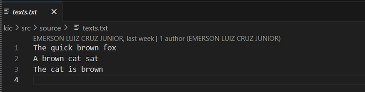
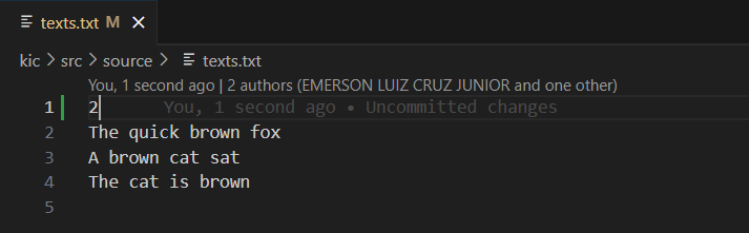
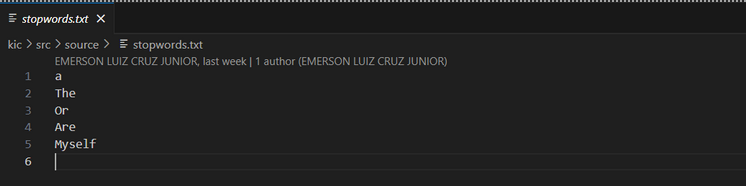

# Keyword-in-context-pipeline-rust

## Introdução
Esse projeto tem o objetivo de exemplificar uma implementação de uma solução para um problema, chamado Keyword in Context (KIC), usando o estilo de programação Pipeline. Para mais explicações sobre o estilo de programação, assista o seguinte vídeo: https://www.youtube.com/watch?v=CqbqiM4VbYc 

O KIC pode ser entendido como um processo no qual é necessário criar uma janela de contexto ao redor de uma palavra destacada no início de uma frase. Dependendo do tamanho da janela de contexto determinado pelo usuário, as palavras à esquerda da palavra destacada são deslocadas circularmente para a direita da frase. A partir da definição de stopwords, é possível especificar quais palavras não devem ser destacadas. Além disso, os contextos gerados devem ser apresentados de forma ordenada alfabeticamente. Portanto uma implementação utilizando Rust e o estilo de programação Pipeline foi desenvolvida. 

  
## Como executar
Para rodar os testes com o cargo basta executar o seguinte comando no cmd/prompt 

```shell 

cargo test. 

``` 

Para rodar um caso personalizado, é necessário realizar alterações nos arquivos texts.txt (definição dos textos) e stopwords.txt (definição das palavras a serem ignoradas). 

Para texts.txt, caso queira definir uma janela de contexto ao redor da palavra, o tamanho da janela deverá ser apresentado na primeira linha (caso queira o texto inteiro, basta ignorar essa primeira linha). As frases devem estar dispostas uma por linha. 


(considerando o texto inteiro) 

 


(definindo uma janela de contexto) 

 

Para stopwords.txt, basta dispor uma palavra por linha. 


(todas essas palavras serão ignoradas) 

 

Para rodar o código com as entradas personalizadas, basta realizar o seguinte comando no cmd/prompt: 

 

` ``shell 

cargo run 

``` 
